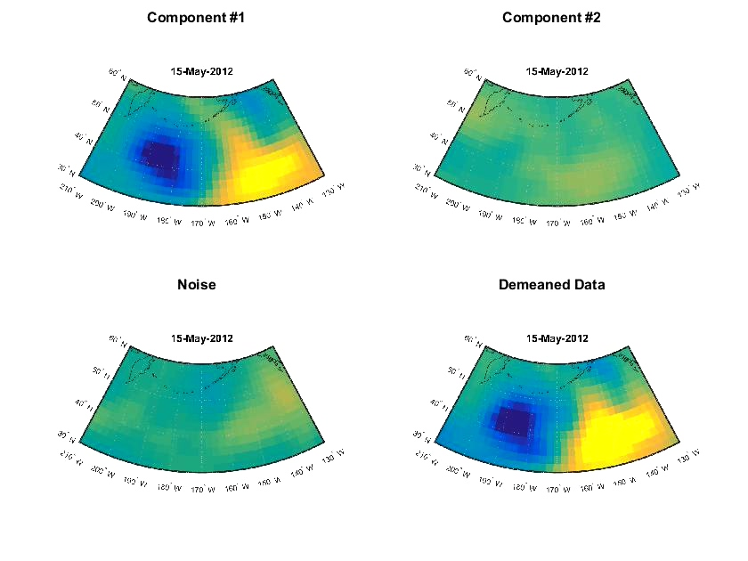

# Sep 2017
# GeoPlot Function for PASF Algorithm

### Function Description

PASF_gplot is collaborating with pasf algorithm to display results on map into a video and running under directory of pasf.
Algorithm of pasf can be found at: https://github.com/khabbazian/pasf.
Using subplot_tight instead of plot. Toolbox can be found at: http://www.mathworks.com/matlabcentral/fileexchange/30884-controllable-tight-subplot
